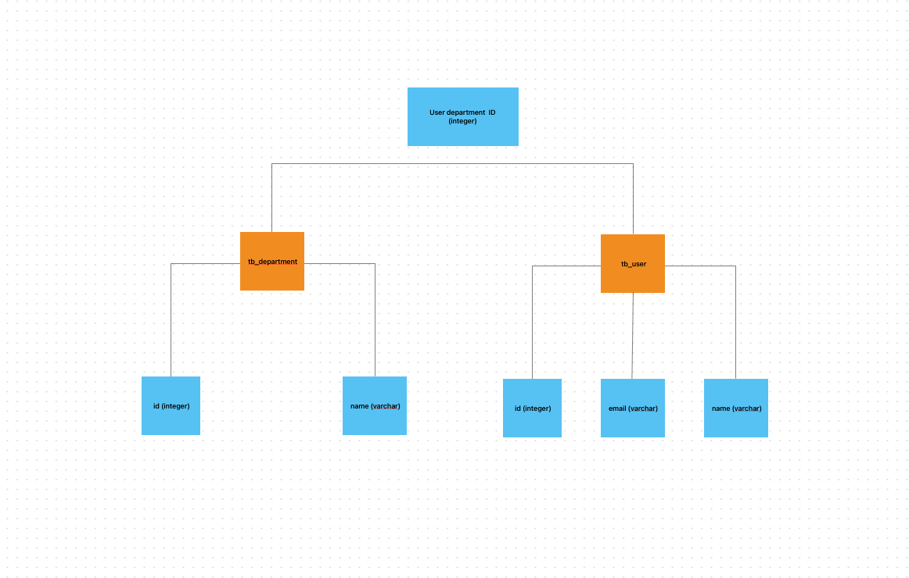

# Enterprise CMS
A simple WebApp to manage users on different departments


# Setup
## Configuration
 Make sure to install Spring Boot, you can check it on the [`official documentation`](https://spring.io)
## Cloning repository to your machine
```
$ git clone https://github.com/Matt-Ferraz/springboot-first.git
```
## Running the app
```
$ mvn spring-boot:run
```
This command will install all dependencies from pom.xml and start the app on PORT 8080

## Database 
It is important that you have the database file in the /User/{username}/ with the name following the application.properties file.

## SQL Script
To populate the database with SQL statements for testing your application, running the application will automatically run the `import.sql` file inside `src/resources` or yuo can use the following command on the h2-console manually.


```
INSERT INTO tb_department(name) VALUES ('Gestão');
INSERT INTO tb_department(name) VALUES ('Informática');

INSERT INTO tb_user(department_id, name, email) VALUES (1, 'Maria', 'maria@gmail.com');
INSERT INTO tb_user(department_id, name, email) VALUES (1, 'Bob', 'bob@gmail.com');
INSERT INTO tb_user(department_id, name, email) VALUES (2, 'Alex', 'alex@gmail.com');
INSERT INTO tb_user(department_id, name, email) VALUES (2, 'Ana', 'ana@gmail.com');
```